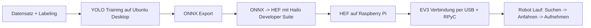

# Butter Robot (Raspberry Pi 5 + Hailo + EV3dev)
.png)

Autonomer Robot fuer Butter-Erkennung und Aufnahme:
- Vision auf Raspberry Pi 5 + Hailo AI HAT+ (26 TOPS)
- Aktorik auf LEGO EV3 (ev3dev) via USB + RPyC
- Web-Ansicht mit Live-Stream und Robot-Status

## Auf Einen Blick

| Thema | Startpunkt |
| --- | --- |
| Installation komplett (inkl. Training/HEF) | [docs/INSTALLATION.md](docs/INSTALLATION.md) |
| Programmablauf + Diagramme | [docs/ARCHITEKTUR_UND_ABLAUF.md](docs/ARCHITEKTUR_UND_ABLAUF.md) |
| Mermaid Ablaufdiagramm (direkt) | [Zum Diagramm](docs/ARCHITEKTUR_UND_ABLAUF.md#programmablauf-als-diagramm-einfach) |
| HEF Hintergrund/Kompatibilitaet | [HEF_ERSTELLUNG_RPI5_AI_HAT_PLUS_26TOPS.md](HEF_ERSTELLUNG_RPI5_AI_HAT_PLUS_26TOPS.md) |
| GitHub/SSH Setup | [docs/GITHUB_SETUP.md](docs/GITHUB_SETUP.md) |

## Schnellstart (HEF bereits vorhanden)

```bash
# 1) Auf EV3
python3 ev3_start_rpyc_server.py --host 0.0.0.0 --port 18812

# 2) Auf Raspberry Pi (USB/RPyC Test)
sudo python3 pi_ev3_rpyc_usb_client.py --iface auto --oneshot --verbose

# 3) Robot starten (Web + Auto-Run)
./start_hailo_webserver.sh
```

Web UI: `http://<pi-ip>:8080`

## Gesamtfluss (Kurz)



## Wichtige Dateien

| Datei | Zweck |
| --- | --- |
| [hailo_butter_ev3_alert.py](hailo_butter_ev3_alert.py) | Autonomer Robot-Flow (State Machine) |
| [hailo_robot_web_control.py](hailo_robot_web_control.py) | Web-UI, Config, Robot-Prozesssteuerung |
| [hailo_web_detect_server.py](hailo_web_detect_server.py) | Reiner Detektions-Stream |
| [pi_ev3_rpyc_usb_client.py](pi_ev3_rpyc_usb_client.py) | Robuste Pi -> EV3 USB/RPyC Verbindung |
| [ev3_start_rpyc_server.py](ev3_start_rpyc_server.py) | EV3 `rpyc_classic` Start |
| [start_hailo_webserver.sh](start_hailo_webserver.sh) | Haupt-Launcher fuer Webbetrieb |
| [start_hailo_butter_alert.sh](start_hailo_butter_alert.sh) | Direktstart ohne Web |
| [requirements-pi.txt](requirements-pi.txt) | Pi Python Dependencies |
| [requirements-ev3.txt](requirements-ev3.txt) | EV3 Python Dependencies |

<details>
<summary><strong>Installationsdetails (ausklappen)</strong></summary>

### End-to-End Reihenfolge

1. Datensatz erstellen/labeln (Klasse `butter`)
2. YOLO auf Ubuntu Desktop trainieren
3. ONNX exportieren
4. ONNX zu HEF (`hailo8`) kompilieren
5. HEF nach `/home/gast/model.hef` auf dem Pi kopieren
6. Pi + EV3 verbinden und testen
7. Robot mit echter Hardware validieren

### Detaildoku

- Vollanleitung: [docs/INSTALLATION.md](docs/INSTALLATION.md)
- HEF-Details: [HEF_ERSTELLUNG_RPI5_AI_HAT_PLUS_26TOPS.md](HEF_ERSTELLUNG_RPI5_AI_HAT_PLUS_26TOPS.md)
- EV3 USB/RPyC Setup: [EV3_RPYC_USB_SETUP.md](EV3_RPYC_USB_SETUP.md)
- EV3 RPyC Library: [EV3_RPYC_CONTROL_LIBRARY.md](EV3_RPYC_CONTROL_LIBRARY.md)

</details>

<details>
<summary><strong>Ablaufdetails (ausklappen)</strong></summary>

Robot-States:
- `SEARCH_RANDOM`
- `APPROACH_BUTTER`
- `PICK_SEQUENCE`
- `DONE_STOP`

Details und Mermaid:
- [docs/ARCHITEKTUR_UND_ABLAUF.md](docs/ARCHITEKTUR_UND_ABLAUF.md)
- [Direkt zum Mermaid-Diagramm](docs/ARCHITEKTUR_UND_ABLAUF.md#programmablauf-als-diagramm-einfach)

</details>

<details>
<summary><strong>Validierung und CI (ausklappen)</strong></summary>

```bash
python3 -m py_compile \
  hailo_butter_ev3_alert.py \
  hailo_web_detect_server.py \
  hailo_robot_web_control.py \
  pi_ev3_rpyc_usb_client.py \
  ev3_start_rpyc_server.py

bash -n start_hailo_butter_alert.sh
bash -n start_hailo_robot_web.sh
bash -n start_hailo_webserver.sh
```

GitHub Action:
- [/.github/workflows/sanity-checks.yml](.github/workflows/sanity-checks.yml)

</details>

<details>
<summary><strong>Weitere Dokumente und Artefakte (ausklappen)</strong></summary>

- Ursprungsskizze: [butter_robot_sketch.md](butter_robot_sketch.md)
- Alternative Setup-Notizen: [EV3_raspberry-setup.md](EV3_raspberry-setup.md)
- Aktivitaetsdiagramm-Dateien: [butter-aktivitatsdiagramm/](butter-aktivitatsdiagramm/)
- Projektdokumentation: [Projektdokumenation-Butterbot.docx](Projektdokumenation-Butterbot.docx)
- Protokollierung: [Protokullierung.docx](Protokullierung.docx)
- Interview Notiz: [Interview Schreibplan.docx](Interview%20Schreibplan.docx)

</details>
