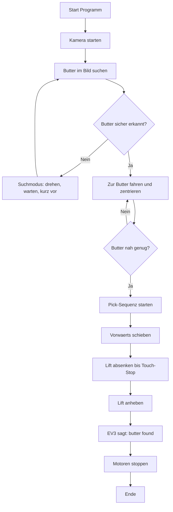

# Architektur und Ablauf

## Programmablauf als Diagramm (einfach)

Hinweis in einfacher Sprache:
- Wenn keine Butter gefunden wird, sucht der Roboter weiter.
- Wenn Butter gefunden wird, faehrt er hin.
- Wenn Butter sehr nah ist, sammelt er sie mit dem Lift ein.

## Komponenten

1. `hailo_web_detect_server.py`
- Kameraaufnahme, Hailo-Inferenz, Bounding-Box Overlay, MJPEG-Stream.
- Stellt `HailoDetector` und `open_capture()` bereit.

2. `hailo_butter_ev3_alert.py`
- Autonomer Ablauf fuer Suche, Anfahrt, Pick, Lift, Ansage.
- Nutzt `HailoDetector` fuer Erkennung und RPyC fuer EV3-Steuerung.
- Optional Telemetrie-JSON fuer Monitoring/Web-Overlay.

3. `hailo_robot_web_control.py`
- Unified HTTP-Server mit Stream, Config-Management und Robot-Prozesssteuerung.
- Startet `hailo_butter_ev3_alert.py` als Subprozess.
- Kann Robot-Input aus geteiltem Raw-Stream (`/raw.mjpg`) beziehen.

4. `pi_ev3_rpyc_usb_client.py`
- Robuster USB-Netzwerk/RPyC-Client Pi -> EV3.
- Interface-Erkennung, IP-Setzen, Reconnect/Healthcheck.

5. `ev3_start_rpyc_server.py`
- Startet `rpyc_classic` auf EV3 und spielt optional Startsound.

## Datenfluss

1. Kamera -> `open_capture()` -> Frames.
2. Frames -> Hailo Inferenz -> Detections (x1,y1,x2,y2,score).
3. Detections -> Statemachine -> EV3 Bewegungsbefehle via RPyC.
4. Statemachine/Detections -> Telemetrie JSON (optional).
5. Web-UI liest Stream + Telemetrie und zeigt Overlay/Status.

## Statemachine (`hailo_butter_ev3_alert.py`)

Startzustand: `SEARCH_RANDOM`

1. `SEARCH_RANDOM`
- Robot dreht/pausiert und macht kurze Vorwaerts-Impulse.
- Wenn `butter` mehrfach bestaetigt (`--confirm-frames` + `--butter-thr`):
  Wechsel zu `APPROACH_BUTTER`.

2. `APPROACH_BUTTER`
- Lenkt auf Box-Mittelpunkt (Kp-Regler) und faehrt vorwaerts.
- Wenn Butter "nah" war und danach verloren geht:
  Wechsel zu `PICK_SEQUENCE`.
- Bei Tracking-Verlust ueber Grenzwert:
  Rueckfall zu `SEARCH_RANDOM`.

3. `PICK_SEQUENCE`
- Vorwaerts schieben (`--push-rotations`).
- Lift absenken bis Touch-Stop/Sicherheitslimit.
- Lift anheben (`--lift-up-rotations`).
- Sprachausgabe (`--speak-text`).
- Danach `DONE_STOP`.

4. `DONE_STOP`
- Motoren stoppen und Lauf beenden.

## Sicherheitsrelevante Logik

- Lift-Stop ist auf Touch-Sensor-Stop ausgelegt.
- Harte Limits:
  - `--lift-stop-max-sec`
  - `--lift-down-max-rotations`
- Software-Fallback kann per Parametern deaktiviert/erzwungen sein.
- Bei `--dry-run` werden keine echten EV3-Motor/Sound-Befehle ausgefuehrt.

## Konfiguration (Web Control)

- Default-Konfiguration in `DEFAULT_CONFIG`.
- Persistenz: JSON-Datei (default `/home/gast/.config/hailo_robot_web/config.json`).
- `build_robot_command()` mappt Web-Config 1:1 auf CLI-Parameter des Robot-Skripts.
