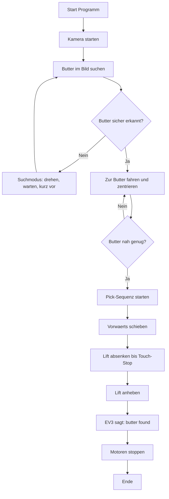
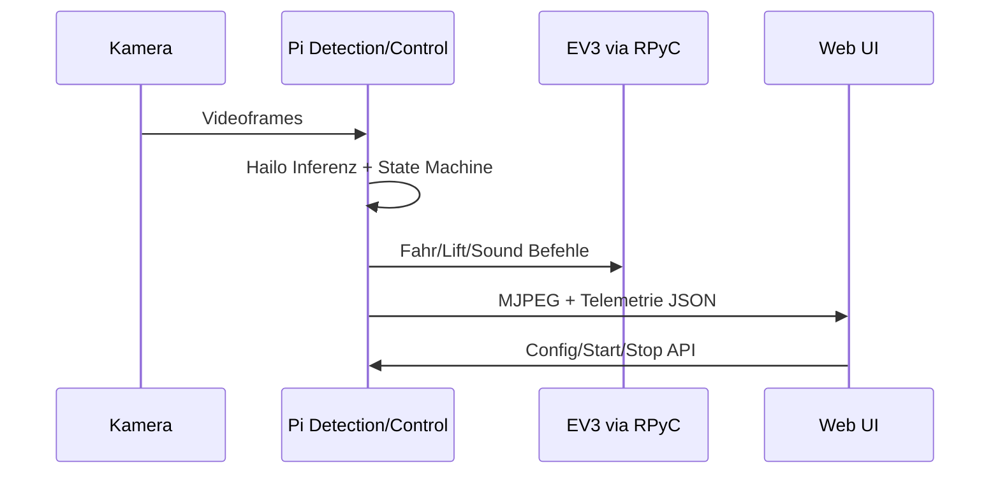

# Architektur und Ablauf

## Kurzfassung

1. Kamera liefert Bilder auf dem Pi.
2. Hailo erkennt Butter.
3. State Machine entscheidet die Bewegung.
4. EV3 bekommt Motorbefehle ueber RPyC.
5. Web UI zeigt Stream + Telemetrie.

## Programmablauf als Diagramm (einfach)

Einfache Erklaerung:
- Ohne sichere Erkennung bleibt der Robot im Suchmodus.
- Mit sicherer Erkennung faehrt er auf das Ziel zu.
- Bei Naehe startet er die Pick-Sequenz.

## Zusammenspiel der Komponenten

## Direktlinks auf zentrale Skripte

- [hailo_butter_ev3_alert.py](../hailo_butter_ev3_alert.py)
- [hailo_robot_web_control.py](../hailo_robot_web_control.py)
- [hailo_web_detect_server.py](../hailo_web_detect_server.py)
- [pi_ev3_rpyc_usb_client.py](../pi_ev3_rpyc_usb_client.py)
- [ev3_start_rpyc_server.py](../ev3_start_rpyc_server.py)

<strong>Komponenten im Detail (ausklappen)</strong>

1. `hailo_web_detect_server.py`
- Kameraaufnahme, Hailo-Inferenz, Box-Overlay, MJPEG-Stream
- Stellt `HailoDetector` und `open_capture()` bereit

2. `hailo_butter_ev3_alert.py`
- Autonomer Ablauf (Suche, Anfahrt, Pick, Lift, Ansage)
- Nutzt Erkennung + RPyC Motorsteuerung
- Optional Telemetrie-JSON fuer Overlay

3. `hailo_robot_web_control.py`
- Webserver mit Stream, Config und Robot-Prozessmanagement
- Startet `hailo_butter_ev3_alert.py` als Subprozess
- Kann `/raw.mjpg` als Quelle fuer den Robot nutzen

4. `pi_ev3_rpyc_usb_client.py`
- USB-Interface Erkennung
- IP-Konfiguration + Reconnect + Healthcheck

5. `ev3_start_rpyc_server.py`
- Startet `rpyc_classic` auf EV3
- Optionaler Startsound

<strong>State Machine im Detail (ausklappen)</strong>

Startzustand: `SEARCH_RANDOM`

1. `SEARCH_RANDOM`
- Drehen, pausieren, kurze Vorwaerts-Impulse
- Bei bestaetigter Erkennung (`--confirm-frames`, `--butter-thr`) -> `APPROACH_BUTTER`

2. `APPROACH_BUTTER`
- Zentrieren mit Kp-Regler + Vorwaertsfahrt
- Ziel nah und dann verloren -> `PICK_SEQUENCE`
- Trackverlust ueber Schwelle -> `SEARCH_RANDOM`

3. `PICK_SEQUENCE`
- Vorwaerts schieben (`--push-rotations`)
- Lift absenken bis Touch-Stop/Sicherheitslimit
- Lift anheben (`--lift-up-rotations`)
- Ansage (`--speak-text`)
- Danach `DONE_STOP`

4. `DONE_STOP`
- Motoren stoppen, Laufende Sequenz beenden

<strong>Sicherheitsrelevante Punkte (ausklappen)</strong>

- Lift-Stop ist auf Touch-Sensor-Stop ausgelegt
- Harte Limits:
  - `--lift-stop-max-sec`
  - `--lift-down-max-rotations`
- `--dry-run` verhindert echte Motor/Sound Befehle
- Motor-/Lift-Grenzen nur mit Hardwaretests aendern

## Konfiguration (Web Control)

- Defaultwerte in `DEFAULT_CONFIG` in [hailo_robot_web_control.py](../hailo_robot_web_control.py)
- Persistenzdatei: `/home/gast/.config/hailo_robot_web/config.json`
- `build_robot_command()` mappt Web-Config auf CLI-Parameter des Robot-Skripts
