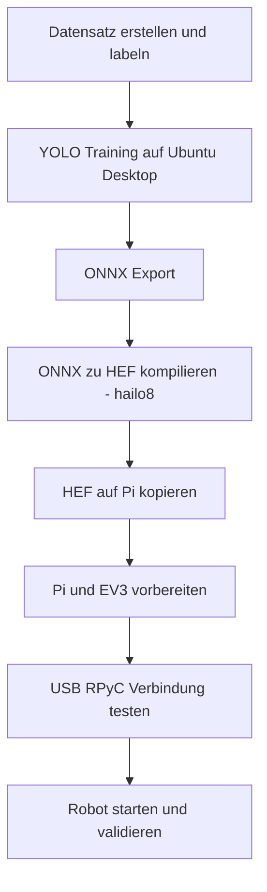

# Installation (Raspberry Pi 5 + EV3dev)

Diese Datei ist nach Prioritaet aufgebaut: oben nur das Wichtigste, Details unten ausklappbar.

## Schnellpfad

Nutze diesen Pfad, wenn dein HEF bereits fertig ist:

1. EV3-Server starten: [ev3_start_rpyc_server.py](../ev3_start_rpyc_server.py)
2. Pi USB/RPyC testen: [pi_ev3_rpyc_usb_client.py](../pi_ev3_rpyc_usb_client.py)
3. Robot starten: [start_hailo_webserver.sh](../start_hailo_webserver.sh)

Alle Befehle sind fuer das Repo-Root (`/home/gast`) geschrieben.

```bash
# EV3
python3 ev3_start_rpyc_server.py --host 0.0.0.0 --port 18812

# Pi
sudo python3 pi_ev3_rpyc_usb_client.py --iface auto --oneshot --verbose
./start_hailo_webserver.sh
```

## End-to-End Prozess (Modell bis Robot)



## Voraussetzungen (kurz)

- Raspberry Pi 5 (Ubuntu) + Hailo AI HAT+ 26 TOPS + Kamera
- LEGO EV3 mit ev3dev
- Datenfaehiges USB-Kabel Pi <-> EV3
- HEF-Pfad im Projektstandard: `/home/gast/model.hef`
- Python Dependencies:
  - Pi: [requirements-pi.txt](../requirements-pi.txt)
  - EV3: [requirements-ev3.txt](../requirements-ev3.txt)

<details>
<summary><strong>A) Modell bauen (Ubuntu Desktop) - ausklappen</strong></summary>

### A1) Datensatz

1. Bilder sammeln (realistische Umgebung).
2. Nur Klasse `butter` labeln (Bounding Boxes).
3. Train/Valid/Test Split.
4. YOLO-Format exportieren.

### A2) YOLO Training (Beispiel)

```bash
python3 -m pip install --upgrade ultralytics

yolo task=detect mode=train \
  model=yolo11n.pt \
  data=/path/to/data.yaml \
  epochs=100 \
  imgsz=640 \
  device=0
```

### A3) ONNX Export

```bash
yolo task=detect mode=export \
  model=/path/to/best.pt \
  format=onnx \
  imgsz=640
```

Output: `best.onnx`

### A4) ONNX -> HEF (Hailo Developer Suite)

Wichtig:
- Zielarchitektur fuer AI HAT+ 26 TOPS: `hailo8`
- Toolchain und Pi-Runtime muessen zusammenpassen

Beispiel (Model Zoo Stil):

```bash
hailomz parse <MODEL_NAME> --hw-arch hailo8
hailomz optimize <MODEL_NAME> --hw-arch hailo8 --calib-path /path/to/calib_images
hailomz compile <MODEL_NAME> --hw-arch hailo8
```

Mehr Details:
- [HEF_ERSTELLUNG_RPI5_AI_HAT_PLUS_26TOPS.md](../HEF_ERSTELLUNG_RPI5_AI_HAT_PLUS_26TOPS.md)

</details>

<details>
<summary><strong>B) Raspberry Pi vorbereiten - ausklappen</strong></summary>

Systempakete:

```bash
sudo apt update
sudo apt install -y \
  python3 python3-pip python3-venv \
  python3-opencv python3-numpy \
  iproute2 iputils-ping
```

Python-Pakete:

```bash
python3 -m pip install --user --break-system-packages -r requirements-pi.txt
```

HEF kopieren:

```bash
scp /path/to/model.hef <pi-user>@<pi-ip>:/home/gast/model.hef
```

HEF pruefen:

```bash
hailortcli fw-control identify
hailortcli parse-hef /home/gast/model.hef
python3 -c "import hailo_platform; print('hailo_platform OK')"
```

Optional (lokales libcamera):

```bash
export LC_PREFIX=/home/gast/.local/libcamera-rpi
```

</details>

<details>
<summary><strong>C) EV3 vorbereiten und verbinden - ausklappen</strong></summary>

Dependencies auf EV3:

```bash
pip3 install -r requirements-ev3.txt
```

USB-IP setzen (Beispiel `usb0`):

```bash
sudo ip link set dev usb0 up
sudo ip -4 addr flush dev usb0
sudo ip -4 addr add 10.42.0.3/24 dev usb0
```

Server starten:

```bash
python3 ev3_start_rpyc_server.py --host 0.0.0.0 --port 18812
```

Pi-Verbindung testen:

```bash
sudo python3 pi_ev3_rpyc_usb_client.py \
  --iface auto \
  --pi-ip 10.42.0.1/24 \
  --ev3-ip 10.42.0.3 \
  --port 18812 \
  --oneshot \
  --verbose
```

</details>

<details>
<summary><strong>D) Start und Validierung - ausklappen</strong></summary>

Robot starten:

```bash
# Web (empfohlen)
./start_hailo_webserver.sh
# Direkt
./start_hailo_butter_alert.sh --left-port A --right-port D --lift-port C
```

Sanity Checks:

```bash
python3 -m py_compile \
  hailo_butter_ev3_alert.py \
  hailo_web_detect_server.py \
  hailo_robot_web_control.py \
  pi_ev3_rpyc_usb_client.py \
  ev3_start_rpyc_server.py

bash -n start_hailo_butter_alert.sh
bash -n start_hailo_robot_web.sh
bash -n start_hailo_webserver.sh
```

</details>

## Troubleshooting (kurz)

| Problem | Kurzloesung |
| --- | --- |
| `invalid message type: 18` | Auf Pi und EV3 `rpyc<6` verwenden |
| `hailo_platform` Importfehler | HailoRT Runtime/Bindings auf Pi pruefen |
| Keine Kamera-Frames | `--source` anpassen, libcamera/GStreamer checken |
| Keine EV3-Verbindung | USB-Kabel, IP `10.42.0.x`, EV3-Serverstatus pruefen |
